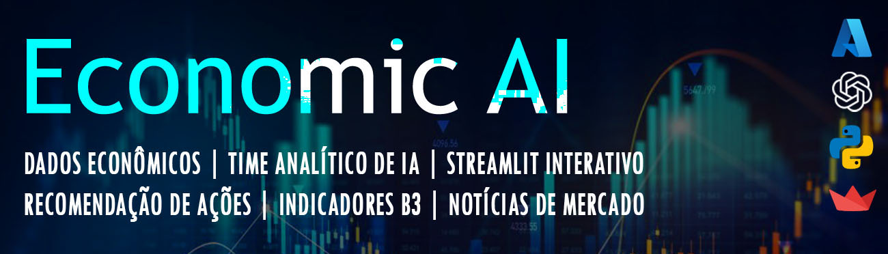

[Link para a página do aplicativo](https://pagina-saida-hwgjgkdbhvb2ctbj.canadacentral-01.azurewebsites.net)

## 🎯 Objetivo

Criar uma plataforma automatizada que simula o trabalho de uma equipe de analistas de investimento, utilizando **IA generativa com agentes colaborativos**, dados econômicos reais e visualização web. O sistema responde a perguntas financeiras e entrega relatórios escritos por uma IA treinada para atuar como analista econômico, especialista em ações e redator financeiro.

---

## ⚙️ Funcionamento

1. **Coleta de Dados**
   - Indicadores econômicos (IPCA, SELIC, PIB, Dólar etc.) via API do Banco Central.
   - Cotações históricas das top 10 ações da B3 via Alpha Vantage.
   - Notícias de economia em tempo real via scraping de grandes portais (CNN, G1, InfoMoney...).

2. **Agentes de IA com CrewAI**
   - Três agentes (macroeconomia, análise de ações e redação) processam os dados e constroem um relatório final de recomendações com base em contexto estruturado + pesquisa online com Serper.

3. **Interface Interativa**
   - Aplicação web com **Streamlit** hospedada no Azure, oferecendo:
     - Chat com agente econômico (LLM da Azure OpenAI)
     - Gráficos interativos de ações e índices
     - Notícias filtradas e atualizadas
     - Relatório completo da análise dos agentes

---

## 🧠 Tecnologias e Conceitos Utilizados

- **Python** (pandas, requests, BeautifulSoup)
- **LangChain + CrewAI + Azure OpenAI**
- **APIs externas**: Banco Central (SGS), Alpha Vantage, Serper.dev
- **Web scraping** para coleta de notícias
- **Streamlit** para visualização
- **.env + dotenv** para gerenciamento de credenciais
- **Estrutura modular e pipelines encadeados**

---

## 💻 Estrutura do Projeto

```bash
.
├── main/
│   └── main.py  # Orquestra os scripts e inicia a interface Streamlit
├── scripts/
│   ├── indicadores_economicos.py
│   ├── acoes.py
│   ├── noticias.py
│   └── agentes_economicos.py
├── streamlit/
│   └── dashboard.py  # Interface interativa para visualização e chat
├── data/
│   ├── indicadores_economicos.csv
│   ├── top_10_acoes.csv
│   └── noticias_investimentos.csv
├── requirements.txt
└── .env
```

---

## 🚀 Como Executar

```bash
# Crie o ambiente virtual e instale as dependências
python -m venv .venv
source .venv/bin/activate  # ou .venv\Scripts\activate no Windows
pip install -r requirements.txt

# Adicione suas chaves de API no .env

# Execute o pipeline
python main/main.py
```

---

# 📈 Economic AI: Análise de Investimentos com CrewAI, Azure e Streamlit

Projeto de portfólio para Engenharia de IA que integra coleta de dados econômicos, análise automatizada com agentes de IA e visualização interativa via Streamlit. O sistema gera **relatórios de recomendação de ações** com base em indicadores econômicos, comportamento de ações da B3 e notícias recentes sobre o mercado financeiro.

---

## 🎯 Objetivo

Criar uma plataforma automatizada que simula o trabalho de uma equipe de analistas de investimento, utilizando **IA generativa com agentes colaborativos**, dados econômicos reais e visualização web. O sistema responde a perguntas financeiras e entrega relatórios escritos por uma IA treinada para atuar como analista econômico, especialista em ações e redator financeiro.

---

## ⚙️ Funcionamento

1. **Coleta de Dados**
   - Indicadores econômicos (IPCA, SELIC, PIB, Dólar etc.) via API do Banco Central.
   - Cotações históricas das top 10 ações da B3 via Alpha Vantage.
   - Notícias de economia em tempo real via scraping de grandes portais (CNN, G1, InfoMoney...).

2. **Agentes de IA com CrewAI**
   - Três agentes (macroeconomia, análise de ações e redação) processam os dados e constroem um relatório final de recomendações com base em contexto estruturado + pesquisa online com Serper.

3. **Interface Interativa**
   - Aplicação web com **Streamlit** hospedada no Azure, oferecendo:
     - Chat com agente econômico (LLM da Azure OpenAI)
     - Gráficos interativos de ações e índices
     - Notícias filtradas e atualizadas
     - Relatório completo da análise dos agentes

---

## 🧠 Tecnologias e Conceitos Utilizados

- **Python** (pandas, requests, BeautifulSoup)
- **LangChain + CrewAI + Azure OpenAI**
- **APIs externas**: Banco Central (SGS), Alpha Vantage, Serper.dev
- **Web scraping** para coleta de notícias
- **Streamlit** para visualização
- **.env + dotenv** para gerenciamento de credenciais
- **Estrutura modular e pipelines encadeados**

---

## 💻 Estrutura do Projeto

```bash
.
├── main/
│   └── main.py  # Orquestra os scripts e inicia a interface Streamlit
├── scripts/
│   ├── indicadores_economicos.py
│   ├── acoes.py
│   ├── noticias.py
│   └── agentes_economicos.py
├── streamlit/
│   └── dashboard.py  # Interface interativa para visualização e chat
├── data/
│   ├── indicadores_economicos.csv
│   ├── top_10_acoes.csv
│   └── noticias_investimentos.csv
├── requirements.txt
└── .env
```

---

## 🚀 Como Executar

```bash
# Crie o ambiente virtual e instale as dependências
python -m venv .venv
source .venv/bin/activate  # ou .venv\Scripts\activate no Windows
pip install -r requirements.txt

# Adicione suas chaves de API no .env

# Execute o pipeline
python main/main.py
```

---

## 📬 Resultados Gerados

A interface visual está disponível via web server hospedado com Azure App Service.

- `data/relatorio_indicacao_acoes.md`: relatório automatizado com recomendações
- Interface visual com:
  - Chat IA sobre economia
  - Gráficos interativos de ações e índices
  - Top 10 notícias relevantes
  - Relatório detalhado da IA

